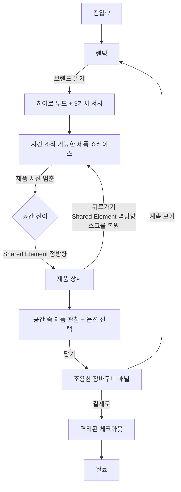
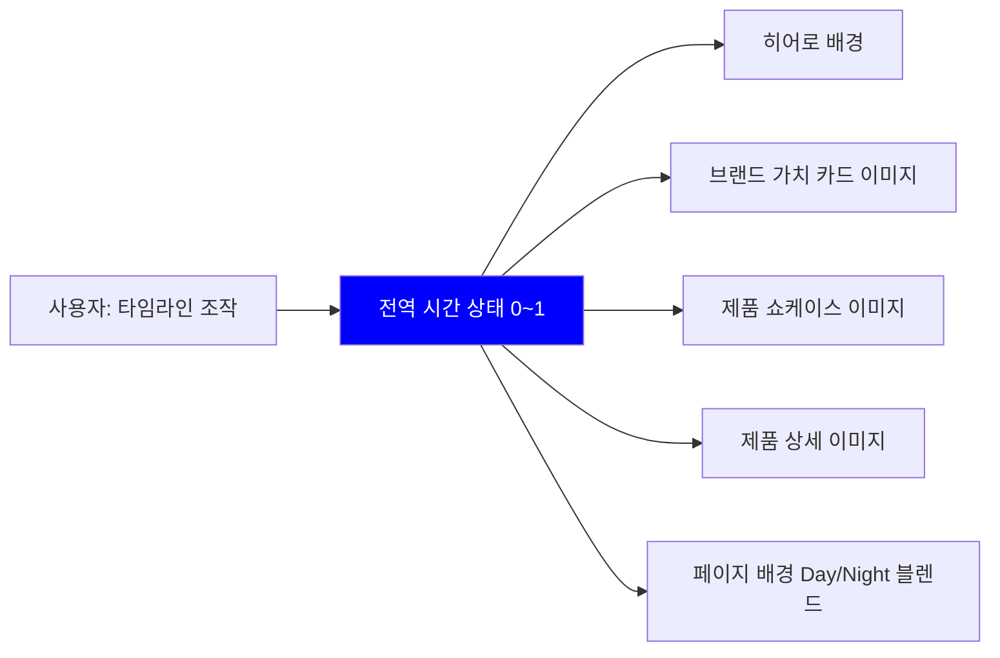

# Lumenstate — UX Flow

> 브랜드 철학(Immanence / Continuity / Flexibility)을 **어떤 사용자 경험으로 체화할 것인가**,
> 그래서 **어떤 UX 패턴과 컴포넌트 유형이 필요한가**를 정의한다.
> 이 문서는 구현체의 목록이 아니라, 구현이 충족해야 할 **경험의 요구 사양**이다.

---

## 유저 시나리오

> 각 시나리오는 "사용자가 무엇을 하는가"보다 **"사용자가 어떻게 느끼는가"** 를 우선 기술한다.
> 브랜드 가치(Immanence / Continuity / Flexibility)가 시나리오 속에 어떻게 녹는지를 우측에 표기한다.

### 시나리오 1 — 브랜드를 "읽는" 첫 만남

- **사용자**: 처음 방문한 건축가 또는 취향 기반 구매자
- **사용자가 기대하는 것**: 스펙표나 배너가 아닌 "이 브랜드가 어떤 세계를 만드는가"를 느낄 수 있는 첫 장면
- **경험의 진행**:
  1. 사이트 진입 순간, 화면은 제품 나열이 아닌 **공간 속 빛의 한 장면**으로 맞이한다. 헤더·네비 같은 UI 요소는 존재감을 죽여 먼저 인상에 끼어들지 않는다. → *Immanence*
  2. 스크롤이 시작되는 순간, 브랜드가 믿는 세 가지 가치가 **짧은 선언 + 한글 해설**로 조용히 등장한다. 화려한 그래픽이 아니라, 건축 저널을 읽는 듯한 리듬이다.
  3. 계속 스크롤하면 공간·제품·빛이 **시간의 흐름 속에서** 어떻게 변화하는지 체험 가능한 구간이 나타난다. 사용자는 "이 사이트가 다르다"는 인상을 3초 안에 잡는다.
- **성공의 느낌**: 페이지를 떠나고 싶지 않다. 이미지 한 장보다 **분위기**가 먼저 기억에 남는다.
- **녹아있는 가치**: Immanence (UI의 절제) · Continuity (시간의 장면) · Flexibility (자동 연출)

---

### 시나리오 2 — 공간에서 제품으로 이어지는 시선

- **사용자**: 랜딩에서 마음에 드는 제품을 발견한 사용자
- **사용자가 기대하는 것**: "이 제품이 놓인 공간"이 "이 제품의 상세"로 **끊김 없이** 이어지는 감각
- **경험의 진행**:
  1. 그리드 속 어떤 카드에 시선이 멈춘다. 그 순간 카드는 이미 제품 이미지가 아니라 **공간의 한 단면**처럼 느껴진다.
  2. 클릭하면 일반적인 "페이지 로딩"이 아니라, 그 이미지 자체가 다음 화면의 히어로 위치로 **자연스럽게 이동**한다. 방금 본 것과 다음에 볼 것이 **같은 대상**이다. → *Continuity*
  3. 상세에서는 제품을 360도로 돌려보는 기술 쇼 대신, 공간 속에서 다양한 각도로 제품을 보며 **옵션(마감·금속·높이)** 을 고른다.
  4. 장바구니에 담는 순간, 결제로 강요당하지 않고 **우측에서 조용히 올라오는 패널**로 확인만 된다. 계속 구경할 수 있다.
  5. 뒤로가기로 랜딩으로 돌아가면, 스크롤 위치가 이전 그대로 복원되고 그리드도 기억된다. "내가 방금 있던 곳으로 되돌아왔다"는 감각이 정확하다.
- **성공의 느낌**: 모든 화면 전환이 **이동**이 아니라 **시선의 이음**처럼 느껴진다. 사용자는 "시스템을 조작한다"는 의식 없이 공간 사이를 오간다.
- **녹아있는 가치**: Continuity (공간 전이·상태 복원) · Immanence (강요하지 않는 장바구니)

---

### 시나리오 3 — 집중된 체크아웃

- **사용자**: 장바구니에서 결제로 넘어온 사용자
- **사용자가 기대하는 것**: 브랜드 톤은 유지되지만, **한 가지 일**에 집중할 수 있는 환경
- **경험의 진행**:
  1. 체크아웃은 랜딩·상세와 시각적 톤은 공유하되, **네비게이션과 유혹 요소를 전부 제거**한다. GNB가 사라지고, 로고만 남는다.
  2. 폼은 "절제된 언더라인" 스타일로, 입력 중에도 브랜드의 차분함이 유지된다.
  3. 우측 요약 영역은 **스크롤에 스티키**로 따라오며, 지금 사는 것이 무엇인지 내내 확인 가능하다.
- **성공의 느낌**: 쇼핑의 즐거움은 랜딩·상세에서 완결됐고, 체크아웃은 **실수 없이 안전하게** 끝난다.
- **녹아있는 가치**: Immanence (서사의 침묵) · Flexibility (필요에 맞춘 모드 변환)

---

### 시나리오 4 (보조) — 시간을 조작하는 관람

- **사용자**: 구매가 목적이 아닌, 사이트 자체를 체험하는 방문자
- **경험의 진행**:
  1. 랜딩 어딘가에서 **시간을 조작할 수 있는 컨트롤**을 발견한다. (드래그/슬라이더/플로팅)
  2. 조작하는 순간 이미지·배경·제품 컷이 **전부 같은 시각으로** 동기화되어 낮↔밤으로 흘러간다.
  3. 조작은 제품을 살 필요가 없는 **관람 그 자체**가 된다.
- **성공의 느낌**: 브랜드의 핵심 가치(Continuity)가 **말이 아니라 조작으로** 증명된다.
- **녹아있는 가치**: Continuity · Flexibility

---

## 핵심 UX 패턴 (컨셉 → 패턴 매핑)

> 브랜드의 세 가치가 실제 인터페이스에서 어떻게 구체화되는가.
> 이 매핑이 **어떤 컴포넌트 유형이 필요한지를 유도**하는 근거가 된다.

### 패턴 1. 시간 블렌딩 (Continuity)

- **언제 드러나는가**: 모든 공간/제품 이미지, 랜딩 배경
- **어떻게 구현되는가**: 같은 장면의 **Day / Night 쌍 이미지**를 하나의 전역 "시간 값(0~1)"으로 블렌드. 시간 값은 어떤 한 컴포넌트가 아니라 **페이지 전체가 구독**한다.
- **사용자가 느끼는 것**: 내가 보는 모든 장면이 **같은 시각을 공유**한다. "시간의 결"이 사이트 전체를 관통한다.
- **유도되는 컴포넌트 유형**:
  - 전역 시간 상태 Provider / 구독 훅
  - 두 이미지를 시간 값으로 블렌드하는 **시간 반응형 이미지** 컴포넌트
  - 시간 값을 조작하는 **타임라인 컨트롤** (슬라이더, 플로팅 버전)

### 패턴 2. 공간 전이 (Continuity × Immanence)

- **언제 드러나는가**: 랜딩 그리드 → 제품 상세 이동 / 상세 → 랜딩 복귀
- **어떻게 구현되는가**: 출발지의 이미지가 도착지의 히어로 위치로 **같은 대상인 채로 이동**. 뒤로가기 시 역방향 재생.
- **사용자가 느끼는 것**: "페이지가 바뀌었다"가 아닌 "시선이 그리로 옮겨갔다".
- **유도되는 컴포넌트 유형**:
  - 전환 전/후 동일 대상을 공유하는 **Shared Element 연출 레이어**
  - 공유 대상의 좌표/크기를 측정·보고하는 **측정 훅**
  - 라우팅 이벤트와 연동된 **전환 상태 전역 컨텍스트**

### 패턴 3. 상태 복원 (Continuity × 사용자 기대선)

- **언제 드러나는가**: 뒤로가기, 새로고침, 탭 복귀
- **어떻게 구현되는가**:
  - 스크롤 위치 — **세션 단위**로 복원 (재방문 세션에선 리셋)
  - 장바구니 — **브라우저 단위**로 영속 (재방문 시 유지)
  - 타임라인 — **휘발** (매번 기본값에서 시작)
- **사용자가 느끼는 것**: "내가 놓고 간 곳에 그대로 있다". 예측대로 움직이는 공간.
- **유도되는 컴포넌트 유형**:
  - 라우팅과 연동된 **스크롤 복원 로직**
  - 영속 저장소를 감싼 **전역 장바구니 상태**

### 패턴 4. 부드러운 스크롤 리듬 (Continuity)

- **언제 드러나는가**: 페이지 어디서나
- **어떻게 구현되는가**: 브라우저 기본 스크롤이 아닌 **부드럽게 감속하는 스크롤**. 섹션 진입 시 점진적 노출.
- **사용자가 느끼는 것**: 디지털의 각진 스크롤이 아니라, **종이를 넘기는 리듬**.
- **유도되는 컴포넌트 유형**:
  - 전역 부드러운 스크롤 엔진
  - 스크롤 진행도를 활용하는 **진입 애니메이션** / **스크롤 기반 스케일/투명도** 컴포넌트

### 패턴 5. 숨은 UI, 등장하는 UI (Immanence)

- **언제 드러나는가**: 랜딩 첫 화면, 체크아웃 진입
- **어떻게 구현되는가**:
  - 랜딩 진입 시 GNB는 **스크롤이 시작되어야** 나타난다.
  - 체크아웃에서는 GNB가 **아예 존재하지 않는다**.
- **사용자가 느끼는 것**: 화면이 첫 인상을 방해하지 않는다. 필요한 순간에만 도구가 나타난다.
- **유도되는 컴포넌트 유형**:
  - 스크롤·라우트 조건에 따라 노출이 달라지는 **조건부 셸 / 네비**
  - 라우팅 분기(앱 셸 안 vs 앱 셸 밖) 구조

### 패턴 6. 조용한 장바구니 (Immanence)

- **언제 드러나는가**: Add to Cart 직후
- **어떻게 구현되는가**: 모달로 흐름을 끊지 않고, **우측 패널**이 조용히 올라온다. 닫으면 원래 있던 곳으로 돌아간다.
- **사용자가 느끼는 것**: "결제를 강요받지 않는다". 관람과 구매가 분리되지 않는다.
- **유도되는 컴포넌트 유형**:
  - 전역 레이어에서 호출되는 **슬라이드 패널 / 드로어**
  - 페이지와 독립적인 **장바구니 토글 상태**

### 패턴 7. 선언적 헤드라인 + 해설적 본문 (브랜드 톤)

- **언제 드러나는가**: 히어로, 브랜드 가치 섹션, 제품 카피
- **어떻게 구현되는가**: **영문 = 선언**, **한글 = 해설**이 의도적으로 병치된다. 헤드라인은 페이지 폭에 맞춰 크게, 본문은 정돈되게.
- **유도되는 컴포넌트 유형**:
  - 컨테이너 폭에 반응하는 **Fit / Stretched 타이포그래피**
  - 하이라이트·인용·인라인 조합 **타이포그래피 프리미티브 세트**

### 패턴 8. 격리된 체크아웃 모드 (Flexibility)

- **언제 드러나는가**: `/checkout` 진입
- **어떻게 구현되는가**: 앱 셸 바깥에서 렌더되는 **독립 레이아웃**. 폼 우측에 **스티키 주문 요약**.
- **유도되는 컴포넌트 유형**:
  - 앱 셸과 별도의 **체크아웃 레이아웃** (좌: 폼, 우: 스티키 요약)
  - 브랜드 톤의 **언더라인 인풋/셀렉트** 세트

---

## UX 플로우

### 전체 경험 플로우



### 시간 블렌딩의 전역 흐름



---

## 정보 구조 (IA) — 경험 단위 관점

```
Lumenstate
├── 랜딩 (브랜드를 읽는 서사)
│   ├── 히어로 · 무드 (Immanence)
│   ├── 브랜드 3가치 (선언 + 해설)
│   ├── 브랜드 서사 인터메조
│   └── 제품 쇼케이스 (시간 조작 + 그리드)
│
├── 제품 상세 (공간 속 제품)
│   ├── 공간 기반 히어로 (전이로 도착)
│   ├── 옵션 선택 영역 (마감 / 금속 / 높이)
│   ├── 담기 액션
│   └── 상세 설명 탭
│
├── 체크아웃 (격리된 결제 모드)
│   ├── 로고 / 단계 표시만 남은 상단
│   ├── 폼 영역 (연락처 / 배송 / 할인)
│   └── 스티키 주문 요약
│
└── 전역 레이어 (경로와 독립)
    ├── 조건부 GNB (스크롤·라우트 기반)
    ├── 장바구니 슬라이드 패널
    └── Shared Element 전환 오버레이
```

---

## 데이터 모델 — 경험을 뒷받침하는 상태

> 엔티티가 아니라 **"어떤 경험을 가능하게 하기 위한 상태인가"** 관점으로 기술.

| 상태 | 무엇을 가능하게 하는가 | 범위 | 영속성 |
|------|----------------------|------|-------|
| **제품 카탈로그** | 쇼케이스·그리드·상세의 소스 | 정적 | 정적 데이터 |
| **선택된 옵션** | 마감·금속·높이 조합을 장바구니 아이템의 정체성으로 사용 | 제품 상세 범위 | 페이지 단위 |
| **장바구니** | 제품+옵션 조합, 수량, 금액. 세션을 넘어 유지 | 전역 | **브라우저 영속** |
| **전역 시간 값** | 모든 이미지가 같은 시각을 공유 | 전역 | 휘발 |
| **Shared Element 컨텍스트** | 전환 시 공유되는 대상의 키·좌표·방향 | 라우팅 순간 | 휘발 |
| **스크롤 상태** | 뒤로가기 시 위치 복원 | 경로 단위 | **세션 영속** |
| **브랜드 콘텐츠** | 문구/이미지를 코드와 분리 | 정적 | 정적 데이터 |

**원칙**: 사용자의 기대선에 맞춰 영속 수준을 나눈다 — 장바구니는 며칠 뒤 다시 와도 남아야 하고, 스크롤은 새 세션에선 리셋되어야 하며, 시간 값은 매번 기본에서 시작한다.

---

## 페이지 & 섹션 구조

### 필요한 페이지

- **Landing** (`/`) — 브랜드 서사 + 제품 쇼케이스
- **Product Detail** (`/product/:id`) — 개별 제품 관찰·담기
- **Checkout** (`/checkout`) — 독립된 결제 화면

### 전역 (모든 페이지 공통)

- Header / GNB
- Cart Drawer (우측 슬라이드)
- Shared Element 전환 레이어
- 시간 전역 상태 (Timeline)

### Landing

- **Hero Section** — 첫 인상, 브랜드 무드
- **Brand Value Section** — 3가치 카드 나열
- **Product Showcase Section** — 타임라인 조작 + 제품 그리드

### Product Detail

- **Hero** — 갤러리 + 옵션 + 담기
- **Info** — 상세 탭 (설명 / 스펙)

### Checkout

- **Form** — 연락처 / 배송 / 할인
- **Summary** — 스티키 주문 요약

---

## 각 섹션의 핵심 컴포넌트

### 전역

- Header
- Cart Drawer
- Shared Element Overlay
- Timeline Provider

### Landing · Hero

- Time Blend 무드보드 이미지
- 브랜드 타이틀 / 태그라인
- 보조 갤러리 이미지

### Landing · Brand Value

- 브랜드 가치 카드 × 3

### Landing · Product Showcase

- 타임라인 슬라이더
- 제품 필터
- 제품 그리드
- 제품 카드 (Time Blend 썸네일)

### Product Detail · Hero

- 제품 갤러리
- 제품 메타 (품번 · 리드타임 · 배송)
- 옵션 선택 (마감 · 금속 · 높이)
- 담기 액션 (수량 + 버튼)

### Product Detail · Info

- 상세 탭

### Checkout

- 로고 바
- 단계 표시
- 폼 묶음
- 주문 요약 (스티키)
- 결제 액션

---

## 전체 계층 정리

```
Global
├── Header
├── Cart Drawer
├── Shared Element Overlay
└── Timeline Provider

Landing  (/)
├── Hero Section
│   ├── Time Blend 무드보드 이미지
│   ├── 브랜드 타이틀 / 태그라인
│   └── 보조 갤러리 이미지
├── Brand Value Section
│   └── 브랜드 가치 카드 × 3
└── Product Showcase Section
    ├── 타임라인 슬라이더
    ├── 제품 필터
    └── 제품 그리드
        └── 제품 카드

Product Detail  (/product/:id)
├── Hero
│   ├── 제품 갤러리
│   ├── 제품 메타
│   ├── 옵션 선택
│   └── 담기 액션
└── Info
    └── 상세 탭

Checkout  (/checkout)
├── 로고 바
├── 단계 표시
├── 폼 묶음
├── 주문 요약
└── 결제 액션
```

### 핵심 컴포넌트 리스트 (플랫)

1. Header
2. Cart Drawer
3. Shared Element Overlay
4. Timeline Provider
5. Time Blend 이미지
6. 브랜드 타이틀 / 태그라인
7. 브랜드 가치 카드
8. 타임라인 슬라이더
9. 제품 필터
10. 제품 그리드
11. 제품 카드
12. 제품 갤러리
13. 제품 메타
14. 옵션 선택
15. 담기 액션
16. 상세 탭
17. 체크아웃 로고 바
18. 체크아웃 단계 표시
19. 폼 묶음
20. 주문 요약
21. 결제 액션

---

## 설계 원칙 (UX 레벨)

1. **전환은 연속이다** — 화면 사이를 "이동"이 아닌 "시선의 이음"으로 설계한다.
2. **시간은 전역 상태다** — 한 화면의 시간이 바뀌면 사이트 전체의 시간이 바뀐다.
3. **UI는 필요할 때만 나타난다** — 첫 인상·결제 집중·서사 몰입을 방해하지 않는다.
4. **상태 영속은 사용자의 기대선에 맞춘다** — 장바구니는 길게, 스크롤은 세션만큼, 시간은 매번 새로.
5. **재활용이 기본, 신규는 도메인·시그니처에만** — 기본 UI는 스타터킷을 그대로 쓰고, 신규 투자는 **이커머스 도메인**과 **브랜드 시그니처 연출**로 제한한다.

---

## 다음 단계

- `03-visual-direction.md` — 위 UX 패턴과 컴포넌트 유형이 따를 **톤·컬러·타이포·간격·쉐이프의 구체적 방향**을 정의한다.
